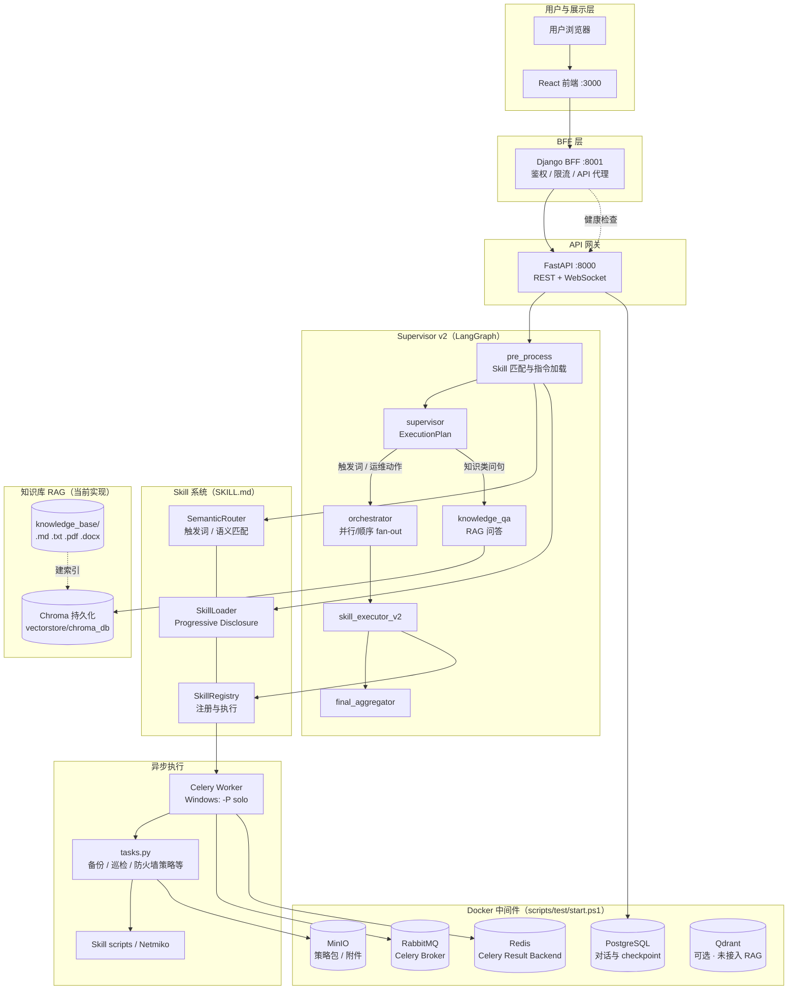

<!-- SPDX-FileCopyrightText: 2026 wangdong <wangdong5919@163.com> -->
<!-- SPDX-License-Identifier: Apache-2.0 -->

# NetOps Agent — AI 驱动的网络运维平台

基于 LLM 的智能网络运维系统，采用 **Supervisor + N 个 Skill** 架构，支持智能路由、RAG 知识问答、
自动化设备操作、防火墙策略生成等。

## 系统架构



> **说明**：知识库向量检索使用**本机 Chroma**，不是 Qdrant。Compose 中的 Qdrant 仅用于健康诊断预留，业务代码未读写该服务。

## 架构说明

### 用户与展示层
| 组件 | 端口 | 职责 |
|------|------|------|
| React | 3000 | 聊天、Skill 管理、系统状态、登录与账户管理 |
| Django BFF | 8001 | 统一 `/api` 入口、JWT 认证、代理 FastAPI、WebSocket 转发 |

多用户认证、RBAC 与 BFF 可信头规范见 **[docs/auth-rbac-plan.md](docs/auth-rbac-plan.md)**；Langfuse + SSE 流式 Trace 见 **[docs/langfuse-sse-plan.md](docs/langfuse-sse-plan.md)**；日志与排障见 **[docs/08_日志规范 & 日志字典](docs/08_日志规范%20&%20日志字典.md)**。演示账号：`admin/admin123` · `operator/operator123` · `viewer/viewer123`。

### API 与编排层
| 组件 | 端口 | 职责 |
|------|------|------|
| FastAPI | 8000 | Agent 图调用、对话 CRUD、RAG 检索、ITSM Webhook |
| Supervisor v2 | — | `pre_process` → `supervisor` → `orchestrator` / `knowledge_qa` → 聚合；`USE_SUPERVISOR_V2=true`（默认） |
| Skill 系统 | — | `SKILL.md` 元数据 + 触发词路由 + `skill_registry` 执行 |
| RAG | — | LlamaIndex + **Chroma**；文档目录 `knowledge_base/` |

### 中间件（实际用途）
| 组件 | 是否必需 | 用途 |
|------|----------|------|
| PostgreSQL | 推荐 | LangGraph checkpoint、对话消息持久化 |
| RabbitMQ | Skill 异步任务 | Celery Broker（见 `.env` 中 `CELERY_BROKER_URL`） |
| Redis | Skill 异步任务 | Celery Result Backend；FastAPI 连接池 |
| MinIO | 防火墙策略等 | 生成结果 ZIP 预签名下载 |
| Qdrant | **否** | 已随中间件启动，**当前 RAG 未使用** |

### 请求路径示例
- **「生成防火墙策略，工单号 rg001」** → 触发词匹配 → 规则调度 → `firewall-policy-generator` → Celery → MinIO 下载链接
- **「交换机接口 down 了怎么办」** → 知识问句过滤 → `knowledge_qa` → Chroma 检索 → LLM 生成回答

## 内置 Skill（6 个）

| Skill | 分类 | 触发示例 |
|-------|------|----------|
| `device-backup` | network | "备份设备配置" "配置备份" |
| `device-patrol` | network | "执行巡检" "设备巡检" |
| `firewall-policy-generator` | security | "生成防火墙策略" |
| `config-diff-tool` | network | "对比配置" "配置差异" |
| `log-analyzer` | network | "分析日志" "日志分析" |
| `network-topology-analyzer` | network | "网络拓扑分析" |

## 快速开始

### 方式一：Docker Compose（推荐）

#### 1. 环境准备
```bash
git clone &lt;repo-url&gt; &amp;&amp; cd netops-agent
# 确保 .env 文件已配置好 DEEPSEEK_API_KEY 等环境变量
```

#### 2. 启动所有服务
```powershell
cd deployment
docker compose up -d
```

#### 3. 访问应用
| 服务 | 地址 |
|------|------|
| React 前端 | http://localhost:3000 |
| Django 后端 | http://localhost:8001 |
| FastAPI 文档 | http://localhost:8000/docs |
| MinIO 控制台 | http://localhost:9001 (minioadmin/minioadmin) |
| RabbitMQ 管理 | http://localhost:15672 (guest/guest) |

### 方式二：PowerShell 脚本

#### 1. 环境准备
```bash
git clone &lt;repo-url&gt; &amp;&amp; cd netops-agent
pip install -r requirements.txt
# 确保 .env 文件已配置
```

#### 2. 一键启动
```powershell
.\scripts\test\start.ps1
```

#### 3. 一键停止
```powershell
.\scripts\test\stop.ps1
```

详见 [scripts/README.md](scripts/README.md)。

## 创建新 Skill

### CLI 一键创建

```bash
# 基本创建
python scripts/create_skill.py -n my-skill -d "我的新技能"

# 完整参数
python scripts/create_skill.py -n my-skill -d "巡检新功能" \
    -c network -t "执行巡检" "设备巡检" --tags inspection device

# 交互模式
python scripts/create_skill.py --interactive
```

### SKILL.md 格式（v2.0）

```markdown
---
name: my-skill
version: 1.0.0
description: 技能描述
category: network
tags: [tag1, tag2]
triggers:
  - "触发词1"
  - "触发词2"
inputs:
  - name: param1
    type: string
    required: true
    description: 参数描述
outputs:
  - name: result
    type: text
    description: 输出描述
enabled: true
fallback_to_rag: true
---

# 技能名称

技能描述正文。

## 核心原则
1. 参数验证：执行前验证所有必填参数
2. 幂等性：相同输入产生相同输出
3. 超时控制：单次执行超过 300s 视为失败

## 核心能力
1. 能力一
2. 能力二

## 工作流程
1. 参数确认 → 2. 任务执行 → 3. 结果处理 → 4. 报告输出

## 输出格式
## 安全规范
## 示例
## 注意事项
```

### 验证 Skill 格式

```bash
# 验证所有 Skill
python scripts/validate_skill.py --all

# 验证单个
python scripts/validate_skill.py src/skills/my-skill/SKILL.md

# CI/CD JSON 输出
python scripts/validate_skill.py --all --json
```

## 项目结构

```
netops-agent/
├── src/
│   ├── skill_system/          # Skill 核心引擎
│   │   ├── __init__.py        # SkillSystem 主类
│   │   ├── metadata.py        # SKILL.md 解析 + v2.0 模板
│   │   ├── router.py          # 3 阶段语义路由
│   │   ├── loader.py          # Progressive Disclosure 加载器
│   │   ├── cache.py           # LRU 缓存 (metadata/instructions/embedding)
│   │   └── security.py        # 权限控制 + 审计日志
│   ├── skills/                # 6 个内置 Skill (SKILL.md 文件驱动)
│   ├── agents/supervisor/     # LangGraph Supervisor v1 / v2
│   ├── common/                # logger / metrics / retry / tracing
│   ├── core/                  # Celery tasks / RAG service
│   ├── gateway/               # FastAPI + WebSocket
│   └── infrastructure/        # PostgreSQL / MinIO
├── web/
│   ├── react_frontend/        # React 前端应用
│   └── django_backend/        # Django 后端应用
├── scripts/
│   ├── create_skill.py        # Skill Creator CLI
│   └── validate_skill.py      # Skill 格式验证工具
├── tests/                     # 统一测试目录
│   └── skill_system/          # 7 个测试文件, 62 个用例
├── docs/                      # 项目文档（01–11 正式系列 + ADR）
│   ├── 01_系统架构设计.md
│   ├── …                      # 见 docs/README.md
│   └── adr/                   # 架构决策记录
├── knowledge_base/            # RAG 原始文档（更新后需重建 Chroma 索引）
├── vectorstore/chroma_db/     # RAG 向量库（Chroma 持久化）
├── scripts/test/              # 测试环境 install / start / stop
├── deployment/                # Docker 配置
│   ├── docker-compose.yml
│   └── docker-compose.middleware.yml
└── .runtime/test/logs/        # 本地启动日志（FastAPI / Celery / React）
```

## 测试

```bash
# 运行所有 Skill 系统测试（62 个用例）
python tests/skill_system/test_cache.py      # LRU 缓存
python tests/skill_system/test_security.py   # 权限 + 审计
python tests/skill_system/test_metadata.py   # SKILL.md 解析
python tests/skill_system/test_router.py     # 语义路由
python tests/skill_system/test_loader.py     # 加载器
python tests/skill_system/test_init.py       # SkillSystem 集成
python tests/skill_system/test_e2e.py        # E2E 集成

# 格式验证
python scripts/validate_skill.py --all        # 所有 Skill 通过
```

## 关键设计原则

- **Metadata 常驻** — 只把 name + description 常驻内存
- **Progressive Disclosure** — 只有匹配的 Skill 正文才注入上下文（800-1500 tokens）
- **指令注入而非函数调用** — Skill = 一套专业规则，而非单个 tool
- **文件系统驱动** — Skill = 目录 + SKILL.md（Git 版本管理友好）
- **3 层容错** — 加载失败 → 降级, 路由失败 → RAG 兜底, 执行异常 → RAG 兜底

## 知识库更新

1. 将文档放入 `knowledge_base/`（支持 `.md` / `.txt` / `.pdf` / `.docx`）。
2. 删除 `vectorstore/chroma_db/` 后重启 FastAPI，触发重新建索引。
3. 用 `POST /api/v1/rag/search` 或聊天中的知识问句验证。

## 文档

**生产一键部署：** [scripts/prod/README.md](scripts/prod/README.md) · [生产上线清单](docs/13_生产上线清单.md)

```powershell
copy .env.example .env
.\scripts\prod\start.ps1
```

完整文档索引见 **[docs/README.md](docs/README.md)**。

| 编号 | 文档 |
|------|------|
| 01 | [系统架构设计](docs/01_系统架构设计.md) |
| 02 | [概要与详细设计](docs/02_概要与详细设计.md) |
| 03 | [数据库设计 & 数据字典](docs/03_数据库设计%20&%20数据字典.md) |
| 04 | [API 接口文档](docs/04_API%20接口文档.md) |
| 05 | [编码 & 工程规范](docs/05_编码%20&%20工程规范.md) |
| 06 | [环境 & 编译构建说明](docs/06_环境%20&%20编译构建说明.md) |
| 07 | [系统配置说明](docs/07_系统配置说明.md) |
| 08 | [日志规范 & 日志字典](docs/08_日志规范%20&%20日志字典.md) |
| 09 | [错误码定义文档](docs/09_错误码定义文档.md) |
| 10 | [部署安装手册](docs/10_部署安装手册.md) |
| 11 | [运维技术手册 & 故障排查](docs/11_运维技术手册%20&%20故障排查.md) |
| 12 | [Supervisor 路由与 Skill 执行流程](docs/12_Supervisor路由与Skill执行流程.md) |
| 13 | [生产上线清单](docs/13_生产上线清单.md) |

**专项指南：** [Skill 创建指南](docs/SKILL_CREATION_GUIDE.md) · [测试手册](docs/测试手册.md) · [认证 RBAC](docs/auth-rbac-plan.md) · [Langfuse SSE](docs/langfuse-sse-plan.md) · [ADR](docs/adr/)

## License

Copyright 2026 [wangdong](mailto:wangdong5919@163.com)

Licensed under the Apache License, Version 2.0. See [LICENSE](LICENSE) for the full text.
