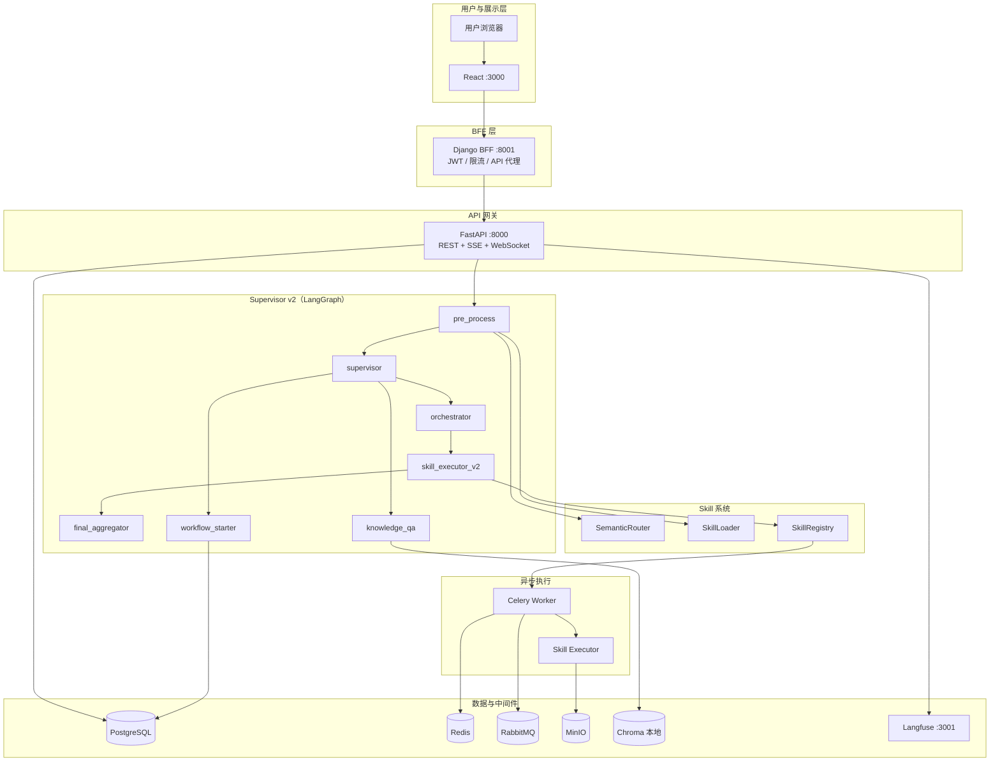

<!-- SPDX-FileCopyrightText: 2026 wangdong <wangdong5919@163.com> -->
<!-- SPDX-License-Identifier: Apache-2.0 -->

# 01 系统架构设计

> 版本：2026-05-24 · 适用仓库：`netops-agent`  
> 关联：[02_概要与详细设计](./02_概要与详细设计.md) · [ADR](./adr/)

---

## 1. 设计目标

NetOps Agent 是 **AI 驱动的网络运维平台**，核心能力包括：

- 自然语言对话 → Supervisor 智能路由 → Skill 执行 / RAG 知识问答 / Workflow 长流程
- 多用户 JWT 认证与 RBAC（Django BFF）
- 异步 Skill 与 Workflow 步骤（Celery）
- 可观测性：structlog 结构化日志 + Langfuse Trace

---

## 2. 逻辑架构



---

## 3. 物理部署与端口

| 组件 | 默认端口 | 必需 | 说明 |
|------|----------|------|------|
| React (Vite/Nginx) | 3000 | 是 | 前端 UI |
| Django BFF | 8001 | 是 | 对外 API 入口、JWT |
| FastAPI Gateway | 8000 | 是 | Agent/Workflow/RAG 核心 |
| PostgreSQL | 5432 | 推荐 | 业务表 + LangGraph checkpoint |
| Redis | 6379 | Skill/Workflow 异步 | Celery Result、连接池、Workflow 事件 pub/sub |
| RabbitMQ | 5672 / 15672 | 可选 | Celery Broker（可改用 Redis） |
| MinIO | 9000 / 9001 | 防火墙/网盘 | 对象存储 |
| Langfuse | 3001 | 可选 | Trace 可视化 |
| Chroma | — | RAG 必需 | 本地 `vectorstore/chroma_db`，无独立服务端口 |
| Qdrant | 6333 | **否** | Compose 中预留，**RAG 未使用** |
| Streamlit | 8501 | 否 | 旧/辅助 UI |

---

## 4. 分层职责

### 4.1 展示层（React）

- 路径：`web/react_frontend/`
- 聊天 SSE、Skill 管理（含 Catalog 治理/归档/灰度）、Workflow 插件/运行监控、网盘、系统状态
- 通过 `/api` 访问 Django BFF（生产 Nginx 反代）
- **响应式 UI**：Grok 风格 Shell；≥768px 固定侧栏，<768px 顶栏 + Drawer（见 `web/README.md`）

### 4.2 BFF 层（Django）

- 路径：`web/django_backend/bff/`
- **JWT 登录/刷新/登出**、用户管理
- **httpx 代理** FastAPI（注入 `X-Forwarded-From: django-bff`、`X-Internal-Request: true`）
- WebSocket 聊天转发：`ws/v1/chat` → FastAPI
- 限流、Request ID 中间件
- 用户数据：**SQLite** `db.sqlite3`（Django `auth_user`）

### 4.3 API 网关（FastAPI）

- 路径：`src/gateway/`
- LangGraph Supervisor 调用、对话 CRUD、RAG、ITSM Webhook
- Workflow / Skill / Storage / Knowledge 子路由
- 全局异常处理器 → 统一错误信封（P2）
- structlog 初始化、`request_id` 注入

### 4.4 编排层（Supervisor v2）

- 路径：`src/agents/supervisor/graph_v2.py`
- 默认启用：`USE_SUPERVISOR_V2=true`
- 节点：`pre_process` → `supervisor` → `orchestrator` / `knowledge_qa` / `workflow_starter` → 聚合
- 状态持久化：PostgreSQL LangGraph checkpoint（`PostgresSaver`）

### 4.5 Skill 系统

- 路径：`src/skill_system/`、`src/skills/`
- **SKILL.md 文件驱动**，Progressive Disclosure 按需加载指令
- 3 阶段路由：触发词 → 语义匹配 → LLM ExecutionPlan
- 执行：`src/core/skills/executor.py`（subprocess / legacy Celery task）

### 4.6 Workflow 引擎

- 定义：`src/workflows/{category}/{id}/WORKFLOW.yaml`（文件为真相源）
- 运行时：`src/core/workflows/engine.py`
- 元数据/运行记录：PostgreSQL `netops_workflow_*`
- 步骤调度：Celery `dispatch_workflow_step_task`

### 4.7 异步任务（Celery）

- 路径：`src/core/celery_tasks/`
- Windows 开发：`celery -P solo`
- 任务：`execute_skill_task`、`dispatch_workflow_step_task` 及兼容别名

---

## 5. 典型数据流

### 5.1 聊天 → Skill（同步/异步）

```
用户 → React → Django /api/chat/stream → FastAPI SSE
  → Supervisor v2 → skill_executor_v2 → skill_registry
  → [可选] Celery → subprocess → MinIO 产物
```

### 5.2 聊天 → Workflow

```
用户 → SSE 聊天 trace（Langfuse 父 trace）
  → workflow_starter → WorkflowEngine.start(parent_trace_id=聊天 trace)
  → Celery 逐步执行 Skill → Redis pub/sub 进度 SSE
  → Langfuse：workflow:* → step:* → skill:*
```

### 5.3 知识问答（RAG）

```
用户问句 → knowledge_qa → LlamaIndex + Chroma（knowledge_base/）
  → LLM 生成回答 + references
```

### 5.4 ITSM Webhook

```
外部 ITSM → Django /api/itsm/webhook/* → FastAPI
  → WorkflowEngine.start(source=itsm_webhook) 或 Skill 触发
```

---

## 6. 安全边界

| 机制 | 说明 |
|------|------|
| JWT | Django 签发，BFF 代理时透传 `Authorization` |
| BFF 来源校验 | `ENFORCE_BFF_ORIGIN=true` 时，FastAPI 拒绝非 BFF 请求（`bff_origin_required`） |
| RBAC | `admin` / `operator` / `viewer`（Django Group + PG `UserSession.role`） |
| ITSM | Webhook Secret 校验；生产建议仅经 BFF 暴露 |

---

## 7. 存储分工

| 存储 | 内容 |
|------|------|
| PostgreSQL | 对话、Workflow、审计、网盘元数据、LangGraph checkpoint |
| Django SQLite | 用户账号、密码哈希、Group |
| MinIO | 策略 ZIP、网盘文件二进制 |
| Chroma | RAG 向量索引 |
| Redis | Celery backend、Workflow 事件 |
| 文件系统 | SKILL.md、WORKFLOW.yaml、`knowledge_base/` |

---

## 8. 架构决策记录（ADR）

| 编号 | 主题 |
|------|------|
| [001](./adr/001-skill-system-architecture.md) | SKILL.md 技能体系 |
| [002](./adr/002-progressive-disclosure.md) | 渐进式 Skill 加载 |
| [003](./adr/003-llm-based-routing.md) | LLM 路由 |
| [004](./adr/004-production-hardening.md) | 生产加固 |
| [005](./adr/005-django-react-architecture.md) | Django + React BFF |
| [006](./adr/006-docker-compose-orchestration.md) | Docker Compose 编排 |

---

## 9. 源码索引

| 目录 | 职责 |
|------|------|
| `src/gateway/` | FastAPI 入口与子路由 |
| `src/agents/supervisor/` | LangGraph 编排 |
| `src/skill_system/` | Skill 引擎 |
| `src/skills/` | 内置 Skill 目录 |
| `src/core/workflows/` | Workflow 引擎 |
| `src/core/celery_tasks/` | Celery 应用与任务 |
| `src/core/skills/` | Skill 执行器 |
| `src/infrastructure/` | PostgreSQL、MinIO |
| `src/observability/` | Langfuse、trace 传播 |
| `web/django_backend/bff/` | BFF 代理 |
| `web/react_frontend/` | React 前端 |
| `deployment/` | Docker Compose 与镜像 |
