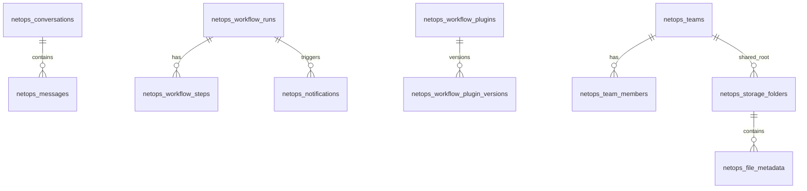

<!-- SPDX-FileCopyrightText: 2026 wangdong <wangdong5919@163.com> -->
<!-- SPDX-License-Identifier: Apache-2.0 -->

# 03 数据库设计 & 数据字典

> 版本：2026-05-24  
> 模型定义：`src/infrastructure/db/models.py`  
> 初始化：`init_db_models(engine)`（FastAPI lifespan 启动时 `create_all`）

---

## 1. 数据库实例分工

| 实例 | 引擎 | 用途 |
|------|------|------|
| **PostgreSQL** | SQLAlchemy + LangGraph PostgresSaver | 业务表、LangGraph checkpoint |
| **Django SQLite** | Django ORM | `auth_user`、`auth_group`（`web/django_backend/db.sqlite3`） |
| **Chroma** | 本地文件 | RAG 向量（非 PG 表） |
| **MinIO** | S3 兼容 | 二进制对象（`object_key` 在 PG 元数据表） |

**连接配置：** 见 [07_系统配置说明](./07_系统配置说明.md) 中 `POSTGRES_*`。

---

## 2. ER 关系概览



---

## 3. PostgreSQL 业务表数据字典

### 3.1 对话与消息

#### `netops_conversations`

| 字段 | 类型 | 说明 |
|------|------|------|
| id | VARCHAR(64) PK | 对话 UUID |
| title | VARCHAR(512) | LLM 生成标题 |
| user_id | VARCHAR(64) | 用户 ID（Django User.id 字符串） |
| thread_id | VARCHAR(64) | LangGraph thread |
| status | VARCHAR(32) | active / archived |
| summary | TEXT | 对话总结 |
| created_at / updated_at | TIMESTAMP | UTC |
| is_deleted | BOOLEAN | 软删除 |

#### `netops_messages`

| 字段 | 类型 | 说明 |
|------|------|------|
| id | VARCHAR(64) PK | 消息 UUID |
| conversation_id | VARCHAR(64) | FK → conversations |
| role | VARCHAR(32) | user / assistant |
| content | TEXT | 消息正文 |
| agent_type | VARCHAR(64) | knowledge_qa / workflow_starter 等 |
| celery_task_id | VARCHAR(64) | 异步任务 ID |
| download_url | VARCHAR(512) | 产物下载 |
| references | JSON | RAG 引用 |
| created_at | TIMESTAMP | UTC |
| is_deleted | BOOLEAN | 软删除 |

### 3.2 用户会话与审计

#### `netops_user_sessions`

| 字段 | 类型 | 说明 |
|------|------|------|
| id | VARCHAR(64) PK | 会话 UUID |
| user_id | VARCHAR(64) | Django User.id |
| username | VARCHAR(128) | 用户名 |
| role | VARCHAR(32) | admin / operator / viewer |
| thread_prefix | VARCHAR(64) | LangGraph 用户级前缀 |
| refresh_jti | VARCHAR(64) | JWT refresh jti |
| ip_address / user_agent | VARCHAR | 客户端信息 |
| is_active | BOOLEAN | 是否有效 |
| created_at / last_seen_at / revoked_at | TIMESTAMP | 生命周期 |

#### `netops_audit_logs`

| 字段 | 类型 | 说明 |
|------|------|------|
| id | VARCHAR(64) PK | 审计 UUID |
| user_id / username | VARCHAR | 操作者 |
| action | VARCHAR(64) | login / chat_stream / skill_execute 等 |
| resource_type / resource_id | VARCHAR | 资源标识 |
| detail | JSON | 扩展详情 |
| ip_address | VARCHAR(64) | 来源 IP |
| status | VARCHAR(32) | success / failed |
| created_at | TIMESTAMP | UTC |

### 3.3 任务与 ITSM

#### `netops_task_status`

| 字段 | 类型 | 说明 |
|------|------|------|
| id | VARCHAR(64) PK | 记录 ID |
| task_id | VARCHAR(64) | Celery Task ID |
| thread_id | VARCHAR(64) | LangGraph Thread |
| user_id | VARCHAR(64) | 用户 |
| source | VARCHAR(32) | chat / itsm_webhook |
| status | VARCHAR(32) | pending / processing / completed / failed |
| agent_type | VARCHAR(32) | 处理 Agent |
| query | TEXT | 原始查询 |
| parameters / result | JSON/TEXT | 参数与结果 |
| file_url | VARCHAR(512) | 文件链接 |
| error_message | TEXT | 错误信息 |
| itsm_callback_url / itsm_callback_status | | ITSM 回调 |
| created_at / updated_at | TIMESTAMP | |
| is_deleted | BOOLEAN | |

#### `netops_itsm_events`

| 字段 | 类型 | 说明 |
|------|------|------|
| id | VARCHAR(64) PK | |
| event_id | VARCHAR(128) UNIQUE | 外部事件 ID |
| event_type | VARCHAR(64) | 事件类型 |
| source_system | VARCHAR(128) | 来源系统 |
| title / description | VARCHAR/TEXT | 标题描述 |
| priority / status | VARCHAR(32) | 优先级/状态 |
| assignee | VARCHAR(128) | 处理人 |
| raw_payload | JSON | 原始报文 |
| created_at / processed_at | TIMESTAMP | |
| result_task_id | VARCHAR(64) | 关联任务 |

### 3.4 知识库索引

#### `netops_knowledge_index`

| 字段 | 类型 | 说明 |
|------|------|------|
| id | INTEGER PK | 自增 |
| file_name / file_path | VARCHAR | 文件信息 |
| file_hash | VARCHAR(128) | 内容哈希 |
| doc_type | VARCHAR(64) | sop / configuration 等 |
| meta_info | JSON | 扩展元数据 |
| vector_ids | JSON | Chroma 向量 ID 列表 |
| is_indexed | BOOLEAN | 是否已索引 |
| created_at / updated_at | TIMESTAMP | |

### 3.5 Workflow

#### `netops_workflow_runs`

| 字段 | 类型 | 说明 |
|------|------|------|
| id | VARCHAR(64) PK | run UUID |
| template_name | VARCHAR(64) | WORKFLOW 模板名 |
| ticket_id | VARCHAR(128) | ITSM 工单号 |
| source | VARCHAR(32) | chat / itsm_webhook |
| user_id / thread_id | VARCHAR(64) | 用户与会话 |
| status | VARCHAR(32) | pending / running / completed / failed |
| context | JSON | 运行时上下文（含 `langfuse_trace_id`、`langfuse_workflow_root_span_id`） |
| current_step_index | INTEGER | 当前步骤索引 |
| error_message | TEXT | 失败原因 |
| created_at / updated_at / completed_at | TIMESTAMP | |

#### `netops_workflow_steps`

| 字段 | 类型 | 说明 |
|------|------|------|
| id | VARCHAR(64) PK | 步骤 UUID |
| run_id | VARCHAR(64) | FK → workflow_runs |
| step_index | INTEGER | 步骤序号 |
| step_name | VARCHAR(64) | WORKFLOW 步骤名 |
| skill_name | VARCHAR(128) | 执行 Skill |
| celery_task_id | VARCHAR(64) | Celery 任务 |
| status | VARCHAR(32) | pending / running / completed / failed |
| input_artifacts / output_artifacts | JSON | 步骤产物 |
| result | JSON | 执行结果 |
| error_message | TEXT | |
| started_at / completed_at | TIMESTAMP | |

#### `netops_workflow_plugins`

| 字段 | 类型 | 说明 |
|------|------|------|
| name | VARCHAR(128) PK | 与 WORKFLOW.name 一致 |
| category | VARCHAR(64) | itsm 等 |
| description | TEXT | |
| plugin_path | VARCHAR(512) | 文件路径 |
| status | VARCHAR(32) | draft / review / published / archived |
| current_version | INTEGER | 当前版本号 |
| created_by / updated_by | VARCHAR(64) | |
| created_at / updated_at / published_at | TIMESTAMP | |

#### `netops_workflow_plugin_versions`

| 字段 | 类型 | 说明 |
|------|------|------|
| id | VARCHAR(64) PK | |
| plugin_name | VARCHAR(128) | 插件名 |
| version | INTEGER | 版本号 |
| files | JSON | WORKFLOW.yaml 等快照 |
| status | VARCHAR(32) | published 等 |
| change_summary | TEXT | 变更说明 |
| created_by | VARCHAR(64) | |
| created_at | TIMESTAMP | |

**唯一约束：** `(plugin_name, version)`

#### `netops_workflow_market_templates`

| 字段 | 类型 | 说明 |
|------|------|------|
| id | VARCHAR(64) PK | |
| title / description | VARCHAR/TEXT | 市场展示 |
| category | VARCHAR(64) | |
| tags | JSON | |
| files | JSON | 模板文件包 |
| source_plugin_name | VARCHAR(128) | 来源插件 |
| featured | BOOLEAN | 推荐 |
| use_count | INTEGER | 使用次数 |
| is_public | BOOLEAN | |
| created_by | VARCHAR(64) | |
| created_at | TIMESTAMP | |

### 3.6 通知

#### `netops_notifications`

| 字段 | 类型 | 说明 |
|------|------|------|
| id | VARCHAR(64) PK | |
| user_id | VARCHAR(64) | 接收用户 |
| title / body | VARCHAR/TEXT | 标题正文 |
| level | VARCHAR(32) | info / success / error |
| payload | JSON | 下载链接等 |
| workflow_run_id / thread_id | VARCHAR(64) | 关联 |
| read_at | TIMESTAMP | 已读时间 |
| created_at | TIMESTAMP | |

### 3.7 网盘（Storage）

#### `netops_teams`

| 字段 | 类型 | 说明 |
|------|------|------|
| id | VARCHAR(64) PK | |
| name | VARCHAR(128) | 团队名 |
| description | TEXT | |
| created_by | VARCHAR(64) | |
| created_at / updated_at | TIMESTAMP | |
| is_deleted | BOOLEAN | |

#### `netops_team_members`

| 字段 | 类型 | 说明 |
|------|------|------|
| id | VARCHAR(64) PK | |
| team_id / user_id | VARCHAR(64) | |
| role | VARCHAR(32) | owner / member / viewer |
| created_at | TIMESTAMP | |
| is_deleted | BOOLEAN | |

#### `netops_storage_folders`

| 字段 | 类型 | 说明 |
|------|------|------|
| id | VARCHAR(64) PK | |
| name | VARCHAR(256) | 目录名 |
| parent_id | VARCHAR(64) | 父目录 |
| owner_id | VARCHAR(64) | 个人目录归属 |
| team_id | VARCHAR(64) | 团队目录归属 |
| visibility | VARCHAR(32) | private / shared |
| path_cache | VARCHAR(1024) | 物化路径 |
| created_by | VARCHAR(64) | |
| created_at / updated_at | TIMESTAMP | |
| is_deleted | BOOLEAN | |

**部分唯一索引：** 每用户一个 private 根目录；每团队一个 shared 根目录。

#### `netops_file_metadata`

| 字段 | 类型 | 说明 |
|------|------|------|
| id | VARCHAR(64) PK | |
| name | VARCHAR(512) | 文件名 |
| folder_id | VARCHAR(64) | 所属目录 |
| object_key | VARCHAR(1024) UNIQUE | MinIO 对象键 |
| owner_id / team_id | VARCHAR(64) | 归属 |
| visibility | VARCHAR(32) | private / shared |
| content_type | VARCHAR(128) | MIME |
| size_bytes | INTEGER | 大小 |
| etag | VARCHAR(128) | |
| status | VARCHAR(32) | pending / active |
| created_by | VARCHAR(64) | |
| created_at / updated_at | TIMESTAMP | |
| is_deleted | BOOLEAN | |

---

## 4. LangGraph Checkpoint

- 由 `langgraph.checkpoint.postgres.PostgresSaver` 自动建表
- 与业务表共享 PostgreSQL 实例
- 初始化：`src/infrastructure/db/postgres.py` → `init_postgres_schema()`

---

## 5. Django 认证表（SQLite）

| 表 | 说明 |
|----|------|
| `auth_user` | 用户名、密码哈希、is_staff、is_superuser |
| `auth_group` | RBAC 组（admin/operator/viewer 映射） |
| `auth_user_groups` | 用户-组关联 |

> Django `chat` app 无自定义 Model（`web/django_backend/chat/models.py` 为空）。

---

## 6. Workflow context JSON 常用键

| 键 | 说明 |
|----|------|
| `ticket_id` | ITSM 工单 |
| `ticket_title` | 工单标题 |
| `policy_file_url` | 上传策略文件 |
| `langfuse_trace_id` | Langfuse trace（嵌套时 = 聊天 trace id） |
| `langfuse_workflow_root_span_id` | Workflow 根 span id |
| `parent_chat_trace_id` | 聊天父 trace |
| `parent_run_id` | 子 Workflow 父 run |

---

## 7. 常用 SQL 示例

```sql
-- 最近 Workflow 运行
SELECT id, template_name, ticket_id, status, created_at
FROM netops_workflow_runs
ORDER BY created_at DESC LIMIT 20;

-- 某 run 的步骤
SELECT step_index, step_name, skill_name, status, error_message
FROM netops_workflow_steps
WHERE run_id = '<run_id>'
ORDER BY step_index;

-- 审计日志
SELECT created_at, username, action, resource_type, status, detail
FROM netops_audit_logs
ORDER BY created_at DESC LIMIT 50;
```

---

## 8. 迁移说明

- **SQLAlchemy 业务表：** 当前通过 `create_all` 自动创建，无 Alembic 迁移链
- **Django：** `python manage.py migrate`（用户表）
- **生产建议：** 引入 Alembic 或 Django migrations 统一管理 PG schema 变更
