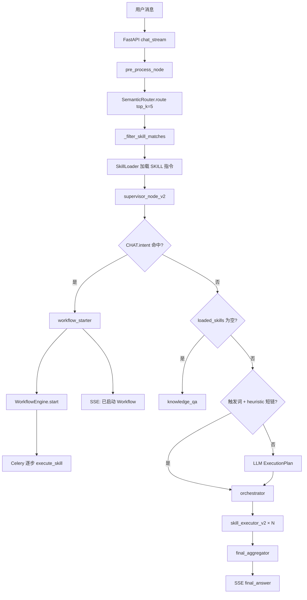
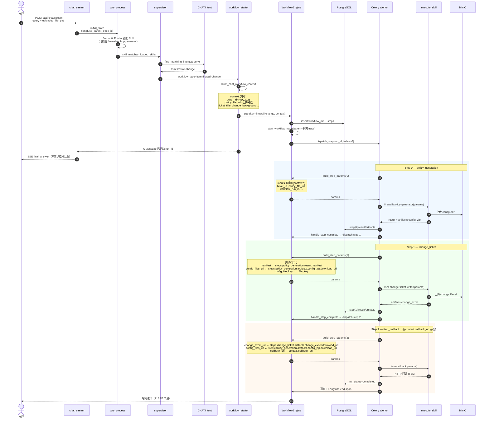

<!-- SPDX-FileCopyrightText: 2026 wangdong <wangdong5919@163.com> -->
<!-- SPDX-License-Identifier: Apache-2.0 -->

# 12 Supervisor 路由与 Skill 执行流程

> 版本：2026-05-24  
> 关联：[02_概要与详细设计](./02_概要与详细设计.md) · [01_系统架构设计](./01_系统架构设计.md)

本文说明：**从用户提问到匹配具体 Skill**，以及 **Workflow 组合的 Skill 链** 在当前实现中的完整路径；并附 **ITSM 防火墙变更** 三步 Skill 的时序与字段传递。

---

## 1. 两条 Skill 编排路径（并存）

| 路径 | Skill 链由谁定义 | 何时使用 | 用户何时看到结果 |
|------|------------------|----------|------------------|
| **A. Workflow** | `WORKFLOW.yaml` 的 `steps` | `CHAT.intent` 命中 / API·Webhook 启动 | 聊天气泡「已启动」；步骤在 **Celery 后台**完成 |
| **B. ExecutionPlan** | graph 内 heuristic 或 LLM | 短链、同轮需汇总 | **同一 SSE 流** `final_aggregator` 聚合回复 |

**Skill 的「匹配」**在 `pre_process`（SemanticRouter）；**Workflow 的「匹配」**在 `supervisor`（`CHAT.intent.yaml`）。Supervisor 中 **Workflow 优先于 ExecutionPlan**。

**产品决策（已落地）：** 短链多 Skill 必须同气泡出结果 → 走 **ExecutionPlan**；固定长流程（如 ITSM 变更）→ 走 **Workflow**。

---

## 2. 端到端总览（聊天 SSE）



---

## 3. 阶段详解

### 3.1 入口与 state

**入口：** `POST /api/chat/stream/` → `src/gateway/chat_stream.py` → `compiled_graph_v2().astream(initial_state)`

| 字段 | 来源 |
|------|------|
| `messages` | 用户 query |
| `uploaded_file_path` / `ticket_id` | 请求体 |
| `langfuse_parent_trace_id` | SSE 聊天 trace（Workflow 嵌套父 trace） |
| `user_id` / `thread_id` / `source` | 认证与会话（默认 `source=chat`） |

---

### 3.2 `pre_process_node` — Skill 匹配（≠ 最终执行）

**文件：** `src/agents/supervisor/graph_v2.py`

1. `SemanticRouter.route(query, top_k=5)` — 触发词 / 标签 / 语义 embedding（可选 LLM Judge）
2. `_filter_skill_matches` — 过滤低置信语义；知识问句且无强触发词则清空
3. 对保留 Skill 加载 `SKILL.md` 正文 → `skill_instructions` + `loaded_skills`
4. 每轮重置 `intermediate_results`、`workflow_type`、`execution_plan`

> 即使用户最终走 Workflow，pre_process **仍会**匹配并加载 Skill；supervisor 走 Workflow 时不会用这些 Skill 拼 ExecutionPlan。

**路由实现：** `src/skill_system/router.py`

---

### 3.3 `supervisor_node_v2` — 决策优先级

| 顺序 | 条件 | 下一节点 | 说明 |
|------|------|----------|------|
| 1 | `find_matching_intents` 命中 | `workflow_starter` | `src/core/plugins/chat_intent.py` + `**/CHAT.intent.yaml` |
| 2 | `loaded_skills` 为空 | `knowledge_qa` | RAG 兜底 |
| 3 | 触发词 + `heuristic_plan` 有效 | `orchestrator` | `src/agents/supervisor/heuristic_plan.py`，链长 ≤3，排除 Workflow 专用 Skill |
| 4 | 否则 | LLM → `orchestrator` 或 RAG | structured ExecutionPlan |

**Heuristic 短链规则：**

- 仅 `match_type=trigger`
- 排除 `WORKFLOW_ONLY_SKILLS`：`itsm-change-ticket-writer`、`itsm-callback`
- 多 Skill 按触发词在话文中的顺序；含「之后/然后/先…后」→ `depends_on` 顺序链，否则并行
- 参数：`_SKILL_PARAM_BUILDERS`（防火墙 / 公文 / 设备等）

---

### 3.4 路径 A — Workflow Skill 链（异步）

| 步骤 | 组件 | 职责 |
|------|------|------|
| 启动 | `workflow_starter_node` | `build_chat_workflow_context` → `WorkflowEngine.start` |
| 定义 | `src/workflows/**/WORKFLOW.yaml` | `steps[].skill` + `inputs` 表达式 |
| 调度 | `WorkflowEngine` | 写 PG run/steps，Celery `dispatch_workflow_step_task` |
| 参解析 | `build_step_params` | `${context.*}`、`${steps.*.artifacts.*}` |
| 执行 | `execute_skill` | Celery Worker / subprocess |
| 进度 | Redis pub/sub | 运行监控 SSE；Langfuse workflow→step→skill |

**聊天 UX：** 同气泡返回「已启动 Workflow」；各 Skill 产物在后台完成，查 run 或站内通知。

---

### 3.5 路径 B — ExecutionPlan Skill 链（同步聚合）

| 步骤 | 组件 | 职责 |
|------|------|------|
| 编排 | `orchestrator_dispatch` | parallel Send 或 sequential 单 Send |
| 执行 | `skill_executor_v2_node` | `skill_registry` / Celery |
| 聚合 | `final_aggregator_node` | 合并 `intermediate_results` → SSE `final_answer` |

---

## 4. 同一 Skill 的两种走法（示例）

| 用户说法 | 匹配 | Skill 链 | 执行 |
|----------|------|----------|------|
| 「生成防火墙策略，工单 rg001」 | 仅 firewall trigger | ExecutionPlan 1 步 | graph 内 → 同气泡 |
| 「防火墙策略 + **编写变更工单**…」 | CHAT.intent | WORKFLOW 三步 | Celery → 后台 |
| 「生成策略 **之后** 巡检设备」 | 两 trigger + 顺序词 | ExecutionPlan 2 步 | graph 内 → aggregator |

---

## 5. 决策优先级（一句话）

```
pre_process：匹配并加载 Skill（供 LLM / heuristic）
supervisor：
  1) CHAT.intent → Workflow（WORKFLOW.yaml steps → Celery）
  2) 无 Skill → RAG
  3) 触发词短链 → heuristic ExecutionPlan（≤3 Skill，graph 内）
  4) LLM ExecutionPlan（即兴组合，graph 内）
```

---

## 6. ITSM 防火墙变更：话术 → 三 Skill 时序

### 6.1 触发条件

**插件：** `src/workflows/itsm/itsm-firewall-change/`

**CHAT.intent.yaml 要点：**

- `require_any`：防火墙 / 策略
- `require_any_secondary`：变更工单 / 编写变更 / itsm / 回调 / 变更流程 等
- `context_from_state`：`policy_file_url` ← `uploaded_file_path` 等

**示例话术：**  
「根据工单 REQ2025，用上传的策略文件生成防火墙策略并编写变更工单」

---

### 6.2 步骤与 Skill 映射

| step.name | skill | 主要 outputs（artifacts） |
|-----------|-------|---------------------------|
| `policy_generation` | `firewall-policy-generator` | `artifacts.config_zip`（`file_key`、`download_url`） |
| `change_ticket` | `itsm-change-ticket-writer` | `artifacts.change_excel` |
| `itsm_callback` | `itsm-callback` | （HTTP 回调 ITSM，可选 `when: ${context.callback_url}`） |

**WORKFLOW 定义：** `src/workflows/itsm/itsm-firewall-change/WORKFLOW.yaml`

---

### 6.3 时序图（含 context / artifacts 传递）



---

### 6.4 字段传递表

#### Run 初始 context（`workflow_starter` → PG `workflow_runs.context`）

| 字段 | 来源 |
|------|------|
| `ticket_id` | 当前用户消息 `extract_ticket_id`（必填，否则 starter 提示） |
| `ticket_title` | `CHAT.intent.context_defaults` / state |
| `policy_file_url` | `uploaded_file_path`（`context_from_state`） |
| `change_background` | 用户 query 摘要（前 500 字） |
| `change_purpose` | intent `context_defaults` |
| `callback_url` / `callback_headers` | state（Webhook 场景） |
| `langfuse_trace_id` / `langfuse_workflow_root_span_id` | 启动后写入（观测） |

#### Step 0 → Step 1

| Step1 入参 | 表达式来源 |
|------------|------------|
| `manifest` | `${steps.policy_generation.result.manifest}` |
| `config_file_key` | `${steps.policy_generation.artifacts.config_zip.file_key}` |
| `config_files_url` | `${steps.policy_generation.artifacts.config_zip.download_url}` |
| `ticket_id` 等 | `${context.ticket_id}` … |

#### Step 1 → Step 2

| Step2 入参 | 表达式来源 |
|------------|------------|
| `change_excel_url` | `${steps.change_ticket.artifacts.change_excel.download_url}` |
| `change_excel_file_key` | `${steps.change_ticket.artifacts.change_excel.file_key}` |
| `config_files_url` / `config_file_key` | 仍引用 step0 的 config_zip artifacts |
| `callback_url` | `${context.callback_url}`（`when` 条件同字段） |

**表达式引擎：** `src/core/workflows/expression.py` — `build_step_env` + `resolve_inputs`（在 `WorkflowEngine.build_step_params` 中调用）。

---

### 6.5 与 ExecutionPlan 路径的边界

| 话术 | 走路径 |
|------|--------|
| 仅「生成防火墙策略，工单 rg001」 | **ExecutionPlan** 单步 `firewall-policy-generator` → 同气泡结果 |
| 含「编写变更工单 / 变更流程」等 secondary 词 | **Workflow** 三步链（本文档） |
| heuristic 链中 | **不会**出现 `itsm-change-ticket-writer` / `itsm-callback`（`WORKFLOW_ONLY_SKILLS`） |

---

## 7. 其他 Workflow 入口（不经 Supervisor）

| 入口 | 说明 |
|------|------|
| `POST /api/itsm/webhook/...` | 直接 `WorkflowEngine.start(source=itsm_webhook)` |
| `POST /api/workflows/runs/` | API / UI 测试运行 |
| `CHAT.intent` + `auto_if_source: itsm_webhook` | Webhook 自动匹配模板 |

Skill 链定义与 Celery 执行路径与聊天触发的 Workflow **相同**。

---

## 8. 关键源码索引

| 环节 | 路径 |
|------|------|
| LangGraph 编排 | `src/agents/supervisor/graph_v2.py` |
| 短链 heuristic | `src/agents/supervisor/heuristic_plan.py` |
| Skill 语义路由 | `src/skill_system/router.py` |
| Workflow 话术 | `src/core/plugins/chat_intent.py` |
| ITSM 插件 | `src/workflows/itsm/itsm-firewall-change/` |
| Workflow 注册 | `src/core/workflows/registry.py` |
| Workflow 运行时 | `src/core/workflows/engine.py` |
| Celery 步骤任务 | `src/core/workflows/tasks.py` |
| Skill 执行 | `src/core/skills/executor.py` |
| SSE 聊天 | `src/gateway/chat_stream.py` |
