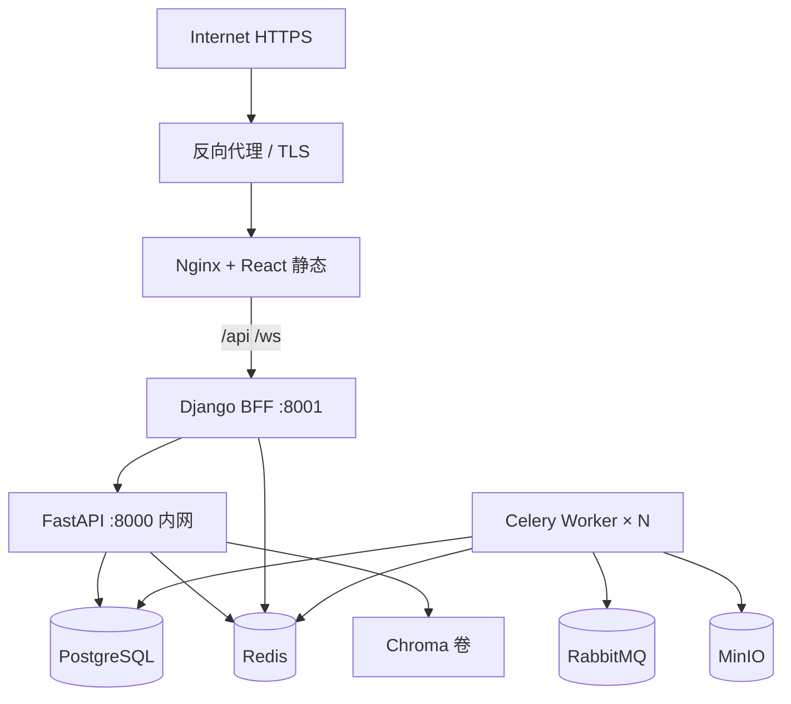

<!-- SPDX-FileCopyrightText: 2026 wangdong <wangdong5919@163.com> -->
<!-- SPDX-License-Identifier: Apache-2.0 -->

# 13 生产上线清单

> 版本：2026-05-24  
> 目标：**先上生产** — 最小可用、可运维、可回滚  
> 关联：[10_部署安装手册](./10_部署安装手册.md) · [07_系统配置说明](./07_系统配置说明.md) · [11_运维技术手册 & 故障排查](./11_运维技术手册%20&%20故障排查.md)

---

## 0. 上线前必须知道的架构事实

| 项 | 生产要求 |
|----|----------|
| 对外入口 | 仅 **React/Nginx :443**（或 :3000 内网），`/api` → Django BFF |
| FastAPI | **不映射宿主机 8000**，`ENFORCE_BFF_ORIGIN=true` |
| Celery Worker | **必须运行**，否则 Workflow / 异步 Skill 不执行 |
| LLM | `DEEPSEEK_API_KEY` 必填，余额不足会导致 RAG 与 LLM 规划失败 |
| 认证 | `BFF_REQUIRE_AUTH=true`，JWT 与 Django/FastAPI 共用密钥 |

---

## 1. 阻塞项（不上线直到完成）

### 1.1 进程与 Compose

- [ ] **Celery Worker 已启动**（与 FastAPI 同版本代码、同 `.env`）
- [ ] FastAPI **禁止 `--reload`**（生产用镜像 CMD 或去掉 reload）
- [ ] RabbitMQ + Redis 健康（Celery broker / result backend）
- [ ] `DJANGO_DEBUG=false`，Django 使用 **uvicorn workers**（见 `Dockerfile.django`）

### 1.2 密钥与默认口令

复制 [`.env.example`](../.env.example) → `.env`，至少更换：

- [ ] `SECRET_KEY` / `JWT_SECRET_KEY`
- [ ] `POSTGRES_PASSWORD`
- [ ] `MINIO_ACCESS_KEY` / `MINIO_SECRET_KEY`
- [ ] `RABBITMQ_DEFAULT_USER` / `RABBITMQ_DEFAULT_PASS`（若改 Compose）
- [ ] `ITSM_WEBHOOK_SECRET`
- [ ] Langfuse `NEXTAUTH_SECRET` / `SALT`（若启用）

Compose 内仍写死的 `netops123456`、`minioadmin`、`guest/guest` **必须在生产 Compose 或 secrets 中覆盖**。

### 1.3 网络暴露

- [ ] **不要**对公网暴露：5432、6379、5672、9000、8000
- [ ] 公网仅：HTTPS → Nginx(React) → Django BFF
- [ ] ITSM Webhook 走 BFF `/api/itsm/webhook/`，必要时 IP 白名单

### 1.4 数据持久化

- [ ] PostgreSQL volume 已备份策略（`scripts/prod/backup.ps1` / `backup.sh`）
- [ ] MinIO volume 已备份策略（同上脚本 mc mirror）
- [ ] `vectorstore/chroma_db` 或挂载 volume（RAG 索引）
- [ ] Django `db.sqlite3`（用户表）纳入备份（备份脚本已包含）

---

## 2. 上线前强烈建议（1–2 天内完成）

### 2.1 配置与文档

- [ ] 根目录 `.env` 与生产域名、`CORS_ALLOWED_ORIGINS` 一致
- [ ] React 构建：`VITE_API_BASE_URL=/api`，WebSocket 走同源 `/ws/` 或配置 `VITE_WS_BASE_URL`
- [ ] **下载链接**：`.env` 设置 `PUBLIC_APP_URL=https://你的域名`（无尾斜杠），Skill/Workflow 附件经 `/api/artifacts/download/` 代理，勿再暴露 MinIO localhost
- [ ] 执行 `python manage.py seed_auth_users` 或创建正式账号，**禁用/修改演示口令**

### 2.2 健康检查

```bash
curl -s http://<bff>/api/health/
curl -s http://<bff>/api/health/diagnostics/
```

确认 `postgres`、`rag`（若启用）为 true。

### 2.3 冒烟测试（最小集）

自动化脚本：`scripts/prod/smoke_test.ps1` / `smoke_test.sh`（覆盖下表 1、6 及 health/diagnostics/Celery）。

| # | 场景 | 预期 |
|---|------|------|
| 1 | 登录 admin/operator | JWT 正常 |
| 2 | SSE 聊天：「交换机端口 down 怎么办」 | RAG 回复 |
| 3 | SSE 聊天：「备份设备配置」 | 同气泡 Skill 或任务结果 |
| 4 | ITSM 话术 + 工单号 + 变更工单关键词 | Workflow 启动，Celery 有 step 日志 |
| 5 | `GET /api/workflows/{run_id}/` | 步骤推进至 completed |
| 6 | viewer 登录执行防火墙类话术 | 403 或友好拒绝 |

### 2.4 日志

- [ ] `LOG_FORMAT=json`（FastAPI / Celery）
- [ ] 容器日志或 `.runtime` 目录可访问
- [ ] 知道排障顺序：BFF → fastapi → celery → Langfuse（见 [11](./11_运维技术手册%20&%20故障排查.md)）

---

## 3. 可上线后迭代（不挡首版）

| 优先级 | 项 | 说明 |
|--------|-----|------|
| P1 | P4 Workflow 审计 | `write_audit_log` 覆盖 run 创建/完成/插件发布 |
| P1 | CI 门禁 | 去掉 `continue-on-error`，关键 E2E 进 CI |
| P2 | Alembic 迁移 | 替代纯 `create_all` |
| P2 | P5 日志平台 | Loki/ELK 采集 |
| P2 | HTTPS 终止 | 外层 Nginx/Traefik + 证书 |
| P3 | User 迁 PostgreSQL | 认证阶段 6 |
| P3 | 去掉 Qdrant 或接入 RAG | 减资源或统一向量库 |
| P3 | Workflow 完成写回会话 | 产品增强 |

---

## 4. 推荐生产拓扑



**Worker 数量：** 至少 1；Skill/Workflow 并发高时水平扩展 Celery，**不要**多实例 FastAPI 图状态冲突（LangGraph checkpoint 在 PG，可多副本，但需会话粘性或统一 thread_id 策略）。

---

## 5. 生产 Compose 启动顺序

**推荐：一键脚本**（预检 → prod overlay → migrate → seed → 冒烟），见 [`scripts/prod/README.md`](../scripts/prod/README.md)。

```powershell
# Windows
copy .env.example .env    # 改密钥与 DEEPSEEK_API_KEY
.\scripts\prod\start.ps1
```

```bash
# Linux
cp .env.example .env
chmod +x scripts/prod/*.sh
./scripts/prod/start.sh
```

**手动步骤（等价）：**

```bash
# 1. 配置 .env（从 .env.example 复制并改密钥）
cp .env.example .env

# 2. 预检（弱密钥 / 必填项）
./scripts/prod/check_env.sh          # 或 check_env.ps1

# 3. 构建并启动（含 celery；生产叠加 prod 绑定 127.0.0.1）
cd deployment
docker compose -f docker-compose.yml -f docker-compose.prod.yml up -d --build

# 4. Django 迁移 + 种子用户（首次）
docker compose exec django python manage.py migrate
docker compose exec django python manage.py seed_auth_users

# 5. 冒烟
../scripts/prod/smoke_test.sh        # 或 smoke_test.ps1

# 6. 上线前备份（T-1）
../scripts/prod/backup.sh            # 或 backup.ps1
```

验证：

```bash
docker compose ps          # celery、fastapi、django、react 均为 Up
docker compose logs celery --tail 50
curl http://127.0.0.1:8001/api/health/
```

---

## 6. 环境变量生产最小集

见 [07_系统配置说明](./07_系统配置说明.md) 与 [`.env.example`](../.env.example)。

**生产硬性组合：**

```env
DEBUG=false
DJANGO_DEBUG=false
LOG_FORMAT=json
ENFORCE_BFF_ORIGIN=true
BFF_REQUIRE_AUTH=true
USE_SUPERVISOR_V2=true
CELERY_BROKER_URL=amqp://<user>:<pass>@rabbitmq:5672//
CELERY_RESULT_BACKEND=redis://redis:6379/1
```

---

## 7. 已知 Compose 陷阱（审查 deployment/docker-compose.yml）

| 问题 | 生产处理 |
|------|----------|
| FastAPI 使用 `pip install` + `--reload` | 改用 `Dockerfile.fastapi` 构建，无 reload |
| 无 Celery 服务 | 增加 `celery` service（已在本仓库 compose 补充） |
| `DJANGO_DEBUG=true` 写死在 environment | 改为 `false` 或由 `.env` 覆盖 |
| Postgres/Redis 映射宿主机端口 | 生产去掉 `ports` 或仅 bind 127.0.0.1 |
| Langfuse 与业务共库 | 可接受 MVP；大规模建议独立 PG |
| Qdrant 未使用 | 首版可不从公网暴露；资源紧可移除 service |

---

## 8. 上线日时间线（建议）

| 时间 | 动作 |
|------|------|
| T-7d | 预生产环境跑通冒烟 6 项；备份空库恢复演练 |
| T-3d | 密钥轮换；CORS/域名；ITSM 联调 |
| T-1d | 冻结镜像 tag；`docker compose pull/build` 固定版本 |
| T-0 | 启服务 → health → 冒烟 → 观察 celery/fastapi 日志 30min |
| T+1d | 查 audit、Langfuse、Workflow 失败率；MinIO 磁盘 |

---

## 9. 回滚策略

1. 保留上一版 Docker 镜像 tag / compose 文件  
2. PG：上线前 `pg_dump`；回滚时恢复 dump（注意 LangGraph checkpoint 与业务表一致）  
3. 仅应用回滚：`docker compose up -d` 指定旧镜像，**不**回滚 DB schema（无 Alembic 时尤其谨慎）  

---

## 10. 首版「完成定义」

满足以下条件即可认为 **生产 MVP 上线**：

1. 用户 HTTPS 登录，聊天 SSE 与 RAG/Skill 可用  
2. ITSM 防火墙 Workflow 在 Celery 中跑通并完成通知  
3. 中间件与密钥非默认值，FastAPI 不裸露公网  
4. 有 health/diagnostics 与基本日志可查  
5. 备份与回滚步骤文档化且演练过一次  

P4/P5、Alembic、Workflow 审计、CI 硬门禁 → **上线后第一轮迭代**。
