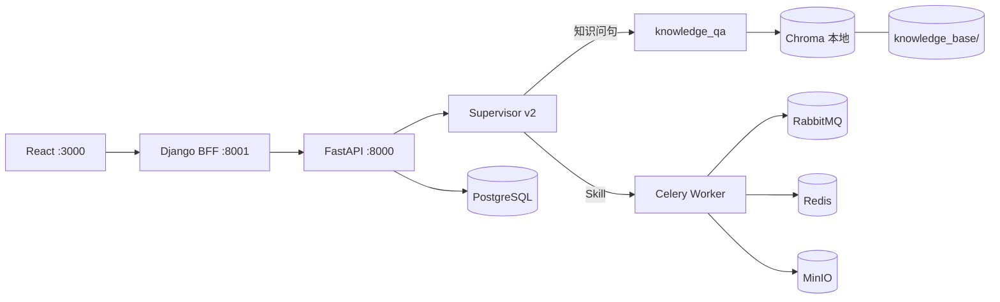

# NetOps Multi-Agent System 使用指南

## 概述

NetOps Multi-Agent System 是一个基于大语言模型的智能运维助手系统，支持：
- 智能问答与故障诊断
- 知识库检索 (RAG)
- 自动化脚本执行
- 防火墙策略生成
- ITSM系统集成

---

## 系统架构（与实现对齐）



| 能力 | 实现 |
|------|------|
| 对话与 Agent 状态 | PostgreSQL + LangGraph checkpoint |
| 知识库 RAG | **Chroma**（`vectorstore/chroma_db`），非 Qdrant |
| 异步 Skill | Celery；Broker 多为 RabbitMQ，结果存 Redis |
| 策略包下载 | MinIO 预签名 URL |

完整架构图与端口说明见仓库根目录 [README.md](../README.md#系统架构)。

---

## 快速开始

### 1. 启动服务

```powershell
# 推荐：一键启动中间件 + FastAPI + Django + React + Celery
.\scripts\test\install.ps1   # 首次
.\scripts\test\start.ps1
```

或手动启动中间件与 Worker，见 [启动手册.md](启动手册.md)、[scripts/README.md](../scripts/README.md)。

### 2. 访问服务

| 服务 | 地址 |
|------|------|
| API文档 | http://localhost:8000/docs |
| 健康检查 | http://localhost:8000/health |
| RabbitMQ | http://localhost:15672 (guest/guest) |

---

## 核心功能

### 1. 智能问答

通过Chat接口提问：

```bash
curl -X POST http://localhost:8000/api/v1/chat \
  -H "Content-Type: application/json" \
  -d '{"query": "交换机端口Down了如何处理？"}'
```

### 2. 防火墙策略生成

#### 方式一：ITSM Webhook触发

```
用户发起ITSM工单 → 执行人员选用Agent工具 → ITSM发送Webhook → 自动生成策略 → 回调ITSM
```

**Webhook地址**: `POST http://localhost:8000/api/v1/itsm/webhook/firewall-policy`

#### 方式二：本地脚本执行

```bash
python tools/firewall-policy/firewall-policy.py \
    -t tools/firewall-policy/topology.json \
    -p tools/firewall-policy/policies.xlsx \
    -o output \
    -u username \
    -i TICKET_ID
```

---

## 目录结构

```
netops-agent/
├── docs/                    # 文档目录
│   ├── 启动手册.md          # 服务启动指南
│   ├── 关闭手册.md          # 服务关闭指南
│   ├── 测试手册.md          # 功能测试指南
│   └── API文档.md           # API接口文档
├── deployment/              # Docker部署配置
│   └── docker-compose.yml   # 中间件编排
├── src/                     # 源代码
│   ├── agents/              # Agent实现
│   ├── core/                # 核心模块
│   │   └── celery_tasks/   # Celery异步任务
│   ├── gateway/             # API网关
│   └── infrastructure/      # 基础设施
├── tools/                   # 运维工具
│   └── firewall-policy/     # 防火墙策略工具
│       ├── firewall-policy.py  # 入口脚本
│       ├── policies.xlsx        # 策略文件示例
│       └── topology.json        # 拓扑文件
└── knowledge_base/          # 知识库文件
    └── sops/                # SOP文档
```

---

## 配置文件

### 环境变量 (.env)

```bash
# LLM配置
LLM_PROVIDER=deepseek
DEEPSEEK_API_KEY=your-api-key
LLM_MODEL=deepseek-chat

# RabbitMQ配置
RABBITMQ_HOST=localhost
RABBITMQ_PORT=5672
RABBITMQ_USER=guest
RABBITMQ_PASS=guest

# Redis配置
REDIS_HOST=localhost
REDIS_PORT=6379

# FastAPI配置
FASTAPI_HOST=0.0.0.0
FASTAPI_PORT=8000
```

---

## 常见问题

### Q1: 任务提交成功但一直处于pending状态

**原因**: Celery Worker未启动

**解决**:
```bash
python -m celery -A src.core.celery_tasks.celery_app worker --loglevel=info -P solo
```

### Q2: 防火墙策略生成失败

**原因**: 缺少openpyxl依赖

**解决**:
```bash
pip install openpyxl
```

### Q3: RabbitMQ连接失败

**原因**: Docker容器未启动或端口被占用

**解决**:
```bash
docker-compose -f deployment/docker-compose.yml up -d rabbitmq
docker ps | grep rabbitmq
```

### Q4: 设备管理功能报错 "No module named 'netmiko'"

**原因**: 缺少 netmiko 库

**解决**:
```bash
pip install netmiko
```

### Q5: 数据库路径错误或权限问题

**原因**: 数据库路径配置错误

**解决**:
1. 确认数据库位置：`tools/backup-inspect/db/devices.db`
2. 检查路径是否有读写权限
3. 重新初始化数据库：
   ```bash
   python tools/init_test_db.py
   ```

---

## 开发指南

### 添加新的Agent

1. 在 `src/agents/` 下创建新Agent目录
2. 实现Agent逻辑
3. 在 `src/agents/supervisor/graph.py` 中注册

### 添加新的Celery任务

1. 在 `src/core/celery_tasks/tasks.py` 中定义任务
2. 使用 `@celery.task` 装饰器
3. 配置重试策略和超时时间

### 添加新的API端点

1. 在 `src/gateway/main.py` 中添加路由
2. 定义请求/响应模型 (schemas.py)
3. 实现业务逻辑

---

## 测试

### 运行所有测试

```bash
# 单元测试
python -m pytest tests/

# 手动测试ITSM Webhook
powershell -File docs/test_itsm_webhook.ps1
```

---

## 技术支持

- 文档: `docs/` 目录
- API测试: http://localhost:8000/docs
- 日志: 查看Celery Worker和FastAPI终端输出
