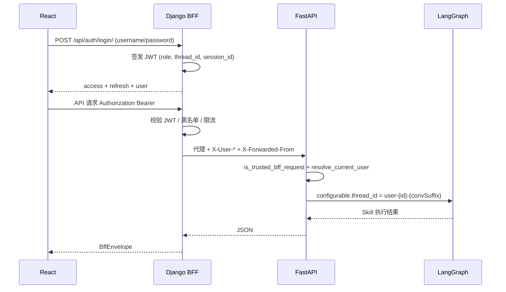

# NetOps Agent — 多用户认证 / 会话隔离 / RBAC 落地方案

> 基于当前架构：**React → Django BFF (8001) → FastAPI (8000) → PostgreSQL + LangGraph**  
> 已按项目现状裁剪 Grok 五阶段方案并完成 **阶段 1–4 MVP**。

## 与 Grok 方案的差异（项目适配）

| Grok 建议 | 本项目现状 | 落地选择 |
|-----------|------------|----------|
| users 表在 PostgreSQL | Django User 在 SQLite | **阶段 1–4**：继续 Django `auth.User` + Group；PG 存会话/审计/业务对话 |
| FastAPI 全路由 JWT | 已有 BFF 转发 + `ENFORCE_BFF_ORIGIN` | **BFF 注入可信头** `X-User-*`，FastAPI 校验 BFF 来源 + 用户上下文 |
| thread_id 在 JWT | 已有 `conv-*` + LangGraph `thread-*` | JWT 带 `thread_id=user-{id}` 前缀，对话级 thread 为 `user-{id}-{convSuffix}` |
| Redis 黑名单 | 未接入 | **阶段 5 已完成**：`src/auth/token_store.py` + 登出/refresh 轮换 |

## 架构（当前）

```
React (/login, Bearer Token)
    ↓
Django BFF — 认证中心
  POST /api/auth/login|refresh|logout|me|change-password
  @require_jwt + @require_role(admin)  on 敏感路由
  转发时注入 X-User-Id / X-User-Role / X-User-Thread-Prefix / X-Session-Id
  Redis：JWT jti 黑名单、session 吊销、登录失败限流、BFF 接口限流
  WebSocket：?token= 或 Authorization Bearer，拒绝未鉴权连接
    ↓
FastAPI — 业务 + RBAC
  src/auth/* 解析 BFF 头或 JWT
  对话 API 按 user_id 隔离
  Supervisor Skill 执行按 user_role 校验
    ↓
PostgreSQL
  netops_conversations / netops_messages（user_id）
  netops_audit_logs / netops_user_sessions（新增）
LangGraph checkpoint — thread_id 含用户前缀
```

## 角色定义

| Django Group | JWT role | Skill 权限 | 能力 |
|--------------|----------|------------|------|
| admin | admin | ADMIN | 全部 Skill、Skill 热加载、知识库重建 |
| operator | operator | POWER_USER | 防火墙/备份/巡检/公文等运维 Skill |
| viewer | viewer | GUEST | 登录与浏览；**不可**执行运维 Skill |

## 快速开始

### 1. 初始化演示用户

```powershell
cd web\django_backend
..\..\venv\Scripts\python.exe manage.py seed_auth_users
```

账号：`admin/admin123` · `operator/operator123` · `viewer/viewer123`

### 2. 环境变量（根目录 `.env`）

Django BFF 与 FastAPI **必须共用**同一组 JWT 配置（`start.ps1` 与 `settings.py` 均从仓库根 `.env` 读取）：

```env
SECRET_KEY=your-shared-secret
JWT_SECRET_KEY=your-shared-secret
JWT_ALGORITHM=HS256
BFF_REQUIRE_AUTH=true
ENFORCE_BFF_ORIGIN=true
REDIS_HOST=localhost
REDIS_PORT=6379
# 可选限流
BFF_RATE_LIMIT_CHAT=30
BFF_RATE_LIMIT_DEFAULT=60
BFF_RATE_LIMIT_IN_DEBUG=false
```

| 变量 | Django | FastAPI | 说明 |
|------|--------|---------|------|
| `JWT_SECRET_KEY` | `SIMPLE_JWT.SIGNING_KEY` | `Settings.JWT_SECRET_KEY` | 优先使用；未设则回退 `SECRET_KEY` |
| `JWT_ALGORITHM` | `SIMPLE_JWT.ALGORITHM` | `Settings.JWT_ALGORITHM` | 默认 `HS256` |
| `SECRET_KEY` | Django `SECRET_KEY` | — | 与 JWT 密钥建议保持一致 |

## 认证流程



## BFF 可信头规范（`X-User-*`）

FastAPI 仅在 **`X-Forwarded-From: django-bff`** 且 **`X-Internal-Request: true`** 时信任以下用户头（见 `src/gateway/bff_security.py`）。客户端直连 FastAPI 时不应信任这些头。

| Header | 必填 | 示例 | 用途 |
|--------|------|------|------|
| `X-Forwarded-From` | 是 | `django-bff` | 标识请求来自 BFF |
| `X-Internal-Request` | 是 | `true` | 内部转发标记 |
| `X-User-Id` | 有登录时 | `42` | 业务数据 `user_id` 隔离 |
| `X-User-Name` | 有登录时 | `operator` | 审计 / 展示 |
| `X-User-Role` | 有登录时 | `operator` | RBAC（admin/operator/viewer） |
| `X-User-Thread-Prefix` | 有登录时 | `user-42` | LangGraph checkpoint 前缀 |
| `X-Session-Id` | 有登录时 | `sess-abc123` | 会话吊销（Redis 黑名单） |
| `X-Request-ID` | 推荐 | UUID | 全链路追踪 |

**LangGraph thread_id 规则**（REST 聊天，`src/gateway/main.py`）：

- 未登录：`thread-{convSuffix}`
- 已登录：`{thread_prefix}-{convSuffix}`，例如 `user-42-a2eba0d128b5`

JWT access token 内嵌相同语义字段：`role`、`thread_id`（即 thread_prefix）、`session_id`。

### 3. 启动后访问

- 前端：http://localhost:3000/login
- BFF 登录：`POST http://localhost:8001/api/auth/login/`

## 分阶段路线图

- **阶段 1–4**：已实现（见仓库 `src/auth/`、`bff/auth.py`、前端 `LoginPage`）
- **阶段 5（已完成）**：
  - Redis JWT 黑名单 + session 吊销（登出立即失效）
  - 登录失败限流（IP/用户名，15 分钟 5 次）
  - BFF 接口限流（Redis 优先，DEBUG 默认关闭）
  - Refresh Token 轮换（旧 refresh 入黑名单）
  - WebSocket JWT 鉴权（`bff/ws_auth.py` + `consumers.py`）
  - 密码修改 `POST /api/auth/change-password/`
  - FastAPI 侧 `resolve_current_user` 校验黑名单
- **阶段 6（可选）**：User 迁 PG、密码重置邮件；Langfuse + SSE 见 [langfuse-sse-plan.md](./langfuse-sse-plan.md)（**已实现 MVP**）

## 账户管理（admin）

| API | 说明 |
|-----|------|
| `GET /api/auth/users/` | 用户列表 |
| `POST /api/auth/users/` | 创建用户（username/password/role） |
| `PATCH /api/auth/users/<id>/` | 更新 role / is_active / email |
| `POST /api/auth/users/<id>/reset-password/` | Admin 重置密码 |

前端：`/users`（仅 admin 可见侧栏入口）。安全规则：不能禁用自己、不能移除最后一个 admin。

## 测试

```powershell
.\venv\Scripts\python.exe -m pytest tests/auth/ -q
```
