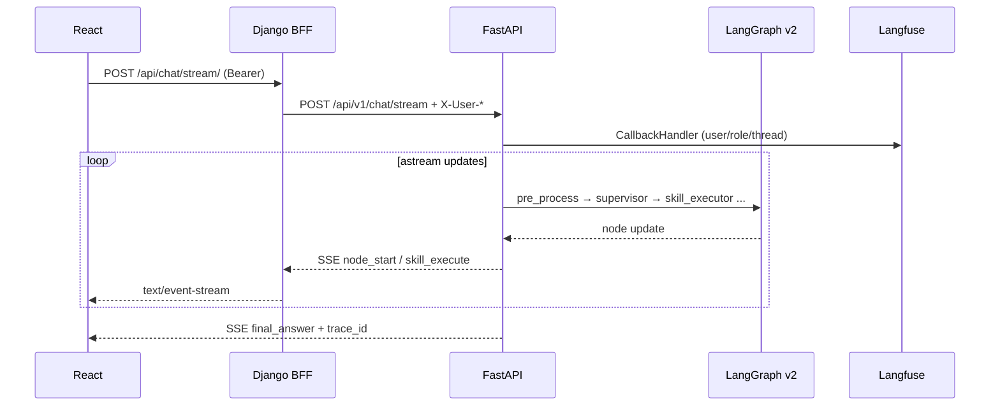

# Langfuse + SSE 流式 Trace 落地方案

> 与 [auth-rbac-plan.md](./auth-rbac-plan.md) 配套：认证完成后，通过 SSE 实时展示 Supervisor v2 执行步骤，并写入 Langfuse。

## 架构



## 阶段 1：Langfuse 自托管

**方式 A（独立栈，推荐开发）**

```powershell
docker compose -f docker/langfuse/docker-compose.yml up -d
# UI: http://localhost:3001
# 登录: admin@netops.local / netops-langfuse-admin
```

使用 **Langfuse v2** 镜像（仅需 Postgres，避免 v3 对 ClickHouse/MinIO 的额外依赖）。

**方式 B（全栈 deployment）**

`deployment/docker-compose.yml` 已含 `langfuse` 服务（端口 **3001**）。

创建项目后，在根目录 `.env` 配置：

```env
LANGFUSE_HOST=http://localhost:3001
LANGFUSE_PUBLIC_KEY=pk-lf-...
LANGFUSE_SECRET_KEY=sk-lf-...
```

## 阶段 2：FastAPI + Langfuse SDK

| 模块 | 说明 |
|------|------|
| `src/observability/langfuse.py` | `get_langfuse_handler()`、`is_langfuse_enabled()` |
| `src/auth/dependencies.py` | `request.state.current_user` 供 tracing 使用 |
| 依赖 | `langfuse`（见 `pyproject.toml`）；SSE 使用 FastAPI `StreamingResponse` |

未配置 Langfuse 密钥时 **自动降级**：SSE 仍可用，仅无 trace 上报。

## 阶段 3：SSE 流式接口

| 路径 | 说明 |
|------|------|
| FastAPI | `POST /api/v1/chat/stream` |
| BFF | `POST /api/chat/stream/` |

**事件类型**

| event | 说明 |
|-------|------|
| `trace_start` | 会话/trace 开始 |
| `status` | 状态文案 |
| `node_start` | 节点完成（pre_process、supervisor 等） |
| `skill_execute` | Skill 执行中 |
| `trace_update` | 进度摘要 |
| `final_answer` | 最终回答（同 REST ChatResponse + trace_id） |
| `error` | 错误 |

实现：`src/gateway/chat_stream.py` + `src/gateway/chat_context.py`

## 阶段 4：认证与权限

- SSE 与 REST 相同：`viewer` 无法执行运维聊天（403）
- **admin / operator**：可见完整 `node_start`、`skill_execute`、`trace_update`
- **viewer**（若未来开放只读聊天）：仅 `trace_start`、`status`、`final_answer`
- 审计：`write_audit_log(action="chat_stream", detail={trace_id, ...})`
- Admin 可在 `final_answer` 中收到 `langfuse_url`

## 阶段 5：React 前端

| 文件 | 说明 |
|------|------|
| `services/chatStream.ts` | `fetch` + SSE 解析 |
| `components/TraceProgress.tsx` | 步骤列表 + 进度条 |
| `pages/ChatPage.tsx` | 默认走流式；失败回退 REST |

## 测试

```powershell
# 依赖
pip install langfuse

# 单元测试
pytest tests/observability/ -q

# 手动 SSE（经 BFF，需 token）
curl -N -H "Authorization: Bearer <token>" -H "Content-Type: application/json" ^
  -d "{\"query\":\"交换机端口 down 如何排查\"}" http://localhost:8001/api/chat/stream/
```

## 回滚

- 前端：`ChatPage` 可改回仅 `chatApi.sendMessage`
- 后端：不调用 `/chat/stream` 即可，REST `/api/v1/chat` 不变
- Langfuse：删除 `.env` 中 `LANGFUSE_*` 即关闭上报
