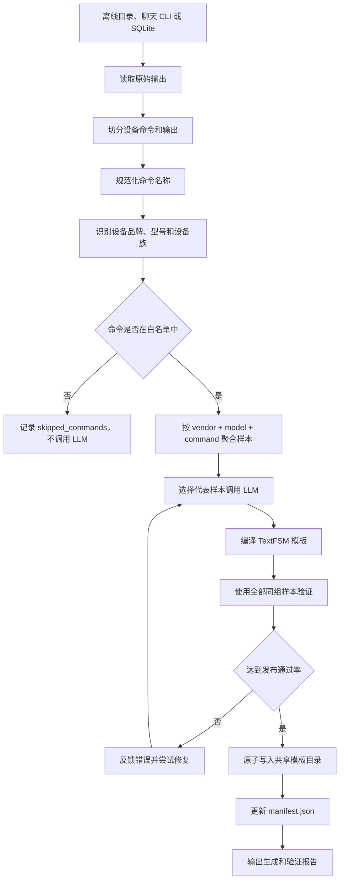

# TextFSM Generator 使用说明

## 1. 功能定位

`textfsm-generator` 用于把网络设备 CLI 原始输出转换为可复用的 TextFSM Parser
资产。

它支持三种输入方式：

1. 离线巡检文件或目录。
2. 聊天中粘贴的单条 CLI 输出。
3. SQLite 巡检数据库中尚未结构化的记录。

生成的模板保存在公共目录：

```text
src/skills/shared/textfsm-templates/
```

该目录不属于某个具体 Skill，可以由 `textfsm-generator`、`device-patrol`、
`patrol-raw-ingestor` 等组件共同使用。

旧目录 `templates/` 只作为兼容性回退路径。

## 2. 整体工作流程



### 2.1 文件读取

离线目录模式递归扫描 `.txt` 和 `.log` 文件，并依次尝试以下编码：

- UTF-8 BOM
- UTF-8
- UTF-16
- UTF-16 LE/BE
- GB18030
- GBK

### 2.2 命令切分

Generator 复用巡检公共命令切分器，支持：

```text
<H3C-SW>display version
...
```

```text
CISCO-SW#show version
...
```

以及带有“命令/输出”标签的报告式文件。

命令会先转为小写、压缩空格，再通过
`config/command_aliases.yaml` 进行别名归一化。例如：

```text
display cpu-us       -> display cpu
display ip int brief -> display ip interface brief
show env power       -> show environment power
show ip int brief    -> show ip interface brief
```

## 3. 品牌和型号识别

### 3.1 离线目录模式的识别顺序

离线文件使用确定性规则识别设备，优先级如下：

1. 调用参数同时提供 `vendor` 和 `model`。
2. 从 `display version` 或 `show version` 输出识别。
3. 从 `display device manuinfo` 或 `show inventory` 输出识别。
4. 根据文件名进行低置信度回退。
5. 仍无法识别时，将文件加入 `unresolved_files`，不生成模板。

只提供 `vendor` 或只提供 `model` 不会覆盖自动识别。需要覆盖时必须同时提供。

### 3.2 H3C 设备识别

H3C 优先匹配 `display version` 中的设备启动信息：

```text
H3C S5130S-54S-HI-G uptime is 21 weeks...
```

识别结果：

```json
{
  "vendor": "H3C",
  "model": "S5130S-54S-HI-G",
  "family": "Comware7",
  "confidence": 0.99,
  "evidence_command": "display version",
  "evidence_text": "H3C S5130S-54S-HI-G uptime"
}
```

如果版本输出不可用，还可以从生产信息中识别：

```text
DEVICE_NAME : MSR5620
VENDOR_NAME : H3C
```

### 3.3 Cisco 设备识别

Cisco Nexus 从 `show version` 的机箱信息识别：

```text
cisco Nexus9000 C93180YC-FX Chassis
```

型号会规范化为：

```text
N9K-C93180YC-FX
```

Catalyst 和 ISR 从处理器或型号信息识别：

```text
cisco WS-C2960XR-24TS-I (...) processor
cisco ISR4451-X/K9 (...) processor
```

识别结果分别为：

```text
Cisco / WS-C2960XR-24TS-I / IOS-C2960
Cisco / ISR4451-X/K9 / IOS-XE-ISR
```

### 3.4 识别规则配置

识别规则位于：

```text
src/skills/textfsm-generator/config/device_signatures.yaml
```

配置包含：

- `detection_rules`：命令、厂商和型号正则。
- `normalization`：型号规范化规则。
- `families`：精确型号到设备族的映射。
- `filename_hints`：低置信度文件名回退规则。

增加新设备时，应优先添加基于 CLI 输出的规则，文件名规则只用于兜底。

## 4. 命令与字段控制

Generator 不会为扫描到的全部命令调用 LLM。

只有 `config/command_mapping.yaml` 中配置的命令才会进入模板生成流程。未配置命令会以
`command_not_configured` 原因写入 `skipped_commands`。

首批支持的主要类别包括：

| 类别 | 示例命令 | 用途 |
|---|---|---|
| `device_version` | `display version`、`show version` | 设备版本和型号 |
| `inventory` | `display device manuinfo`、`show inventory` | 硬件资产 |
| `cpu` | `display cpu`、`show processes cpu` | CPU 变化和高负载事件 |
| `memory` | `display memory`、`show processes memory` | 内存状态 |
| `interface_l3` | `display interface brief`、`show ip interface brief` | 三层接口状态 |
| `interface_l2` | `show interface status` | 二层端口状态 |
| `fan` | `display fan`、环境风扇命令 | 风扇状态 |
| `power` | `display power`、环境电源命令 | 电源状态 |
| `temperature` | `display environment` | 温度传感器 |
| `vrrp` | `display vrrp statistics`、`show vrrp brief` | VRRP 状态 |
| `redundancy` | `display irf`、`show vpc` | 堆叠和冗余状态 |

字段契约位于：

```text
src/skills/textfsm-generator/config/command_categories.yaml
```

每个类别可以配置：

- `entity_type`：交给 change-detector 的实体类型。
- `primary_keys`：跨巡检周期保持稳定的实体主键。
- `required_fields`：每条结构化记录必须存在的字段。
- `optional_fields`：输出存在时才提取的字段。
- `validators`：百分比、枚举等字段校验。
- `allow_empty`：是否允许合法空结果。
- `empty_patterns`：判断“功能未配置”等合法空结果的模式。
- `ignore_fields`：后续变化比较可忽略的易变字段。

## 5. 模板生成和验证

### 5.1 样本分组

目录中的输出按以下键分组：

```text
vendor + exact model + canonical command
```

例如，以下设备不会混在同一个生成组中：

```text
Cisco N9K-C9364C / show version
Cisco WS-C2960XR-24TS-I / show version
```

即使命令相同，不同型号仍会生成独立的精确型号模板。

### 5.2 LLM 输入

默认最多选择 3 个代表样本发送给 LLM：

```json
{
  "max_samples_per_prompt": 3
}
```

该参数只控制 LLM 上下文大小，不影响验证范围。

### 5.3 全样本验证

生成后的模板会对同组全部样本执行：

1. TextFSM 编译检查。
2. 输出解析检查。
3. 每条记录的必填字段检查。
4. 字段值合法性检查。
5. 合法空结果检查。

默认发布门槛：

```json
{
  "minimum_sample_pass_rate": 1.0
}
```

即同型号、同命令的全部样本必须通过。

验证失败时，错误会反馈给 LLM 修复，最多重试 `max_retries` 次。仍不通过则不发布。

### 5.4 共享资产发布

模板路径格式：

```text
src/skills/shared/textfsm-templates/{model_slug}/{command_slug}.textfsm
```

例如：

```text
src/skills/shared/textfsm-templates/
  N9K-C9364C/
    show_version.textfsm
  S5130S-54S-HI-G/
    display_cpu.textfsm
```

型号中的 `/` 等路径非法字符会转换为 `_`：

```text
ISR4451-X/K9 -> ISR4451-X_K9
```

发布使用原子文件替换，避免其他 Skill 读取到只写了一部分的模板。

`manifest.json` 保存：

- 厂商、原始型号和设备族。
- 命令和字段类别。
- 实体类型和主键。
- 必填及可选字段。
- Parser 版本。
- 模板相对路径和 SHA-256。
- 验证样本数和通过率。
- 发布时间。

模板查找顺序为：

1. 共享目录中的精确型号模板。
2. 共享目录中的设备族模板。
3. 旧 `templates/` 中的精确型号模板。
4. 旧 `templates/` 中的设备族模板。

## 6. 使用方法

### 6.1 通过聊天使用

可以在聊天中直接指定目录：

```text
请使用 textfsm-generator 扫描
"C:\patrol-data"
生成并验证 TextFSM 模板
```

Supervisor 会把引号中的 Windows 路径转换为：

```json
{
  "source_path": "C:\\Users\\wangd\\PycharmProjects\\PythonProject\\netops-agent\\dev_test",
  "user_query": "原始聊天内容"
}
```

也可以粘贴单条 CLI：

```text
<SW1>display cpu
Slot 1 CPU 0 CPU usage:
  26% in last 5 seconds
  15% in last 1 minute
  14% in last 5 minutes
```

单条模式建议明确提供 `vendor` 和 `model`，以免语义识别不准确。

### 6.2 通过 Skill 参数使用

推荐的离线目录参数：

```json
{
  "source_path": "C:\\patrol-data",
  "recursive": true,
  "publish": true,
  "minimum_sample_pass_rate": 1.0,
  "max_samples_per_prompt": 3,
  "max_retries": 3
}
```

只生成指定命令：

```json
{
  "source_path": "C:\\patrol-data",
  "command": "display cpu",
  "publish": true
}
```

显式指定设备：

```json
{
  "source_path": "C:\\patrol-data\\device.txt",
  "vendor": "H3C",
  "model": "S5130S-54S-HI-G"
}
```

仅发现和验证，不写入模板：

```json
{
  "source_path": "C:\\patrol-data",
  "dry_run": true,
  "publish": false
}
```

强制重新生成已有模板：

```json
{
  "source_path": "C:\\patrol-data",
  "command": "show version",
  "force_generate": true
}
```

### 6.3 通过命令行使用

扫描整个目录：

```powershell
.\venv\Scripts\python.exe `
  src\skills\textfsm-generator\scripts\run.py `
  --source-path "C:\patrol-data"
```

只处理一条命令：

```powershell
.\venv\Scripts\python.exe `
  src\skills\textfsm-generator\scripts\run.py `
  --source-path "C:\patrol-data" `
  --command "display cpu"
```

试运行：

```powershell
.\venv\Scripts\python.exe `
  src\skills\textfsm-generator\scripts\run.py `
  --source-path "C:\patrol-data" `
  --dry-run `
  --no-publish
```

通过平台参数文件调用：

```powershell
.\venv\Scripts\python.exe `
  src\skills\textfsm-generator\scripts\run.py `
  --params ".runtime\textfsm-params.json"
```

## 7. 输出说明

目录模式的主要输出：

```json
{
  "success": true,
  "mode": "directory",
  "files_scanned": 54,
  "devices_detected": 54,
  "device_profiles": [],
  "candidate_groups": 40,
  "generated_templates": [],
  "skipped_commands": [],
  "unresolved_files": [],
  "validation_pass_rate": 1.0,
  "summary_path": "...",
  "shared_templates_dir": "..."
}
```

字段说明：

- `files_scanned`：找到的 `.txt/.log` 文件数。
- `devices_detected`：成功识别厂商和型号的文件数。
- `device_profiles`：识别到的设备档案及识别证据。
- `candidate_groups`：按厂商、型号和命令聚合后的候选组数。
- `generated_templates`：本次新发布的模板路径。
- `skipped_commands`：不在白名单中的命令。
- `unresolved_files`：无法识别设备的文件。
- `validation_pass_rate`：本次所有候选样本的总通过率。
- `reports`：各模板组的详细验证结果。
- `summary_path`：本批次汇总报告路径。

如果目录中存在无法识别的文件，`success` 为 `false`，但已识别文件仍会继续处理。

## 8. 常见问题

### 8.1 命令被跳过

报告原因：

```text
command_not_configured
```

检查 `command_mapping.yaml` 是否为对应厂商和型号配置了该命令。

不要仅为了消除跳过记录而加入命令。应先确定它是否能形成稳定实体和有价值的变化。

### 8.2 文件无法识别设备

检查文件是否包含：

- `display version`
- `show version`
- `display device manuinfo`
- `show inventory`

如果输出格式是新的设备类型，应在 `device_signatures.yaml` 中增加规则。

### 8.3 模板生成但没有发布

常见原因：

- TextFSM 语法错误。
- 某些样本解析记录数为 0。
- 必填字段在部分记录中为空。
- 百分比等字段值不合法。
- 全样本通过率低于 `minimum_sample_pass_rate`。
- 使用了 `dry_run=true` 或 `publish=false`。

详细原因位于每个报告的 `sample_results` 和 `errors`。

### 8.4 已有模板没有重新生成

默认行为是验证已有模板，不覆盖它。

需要重新生成时设置：

```json
{
  "force_generate": true
}
```

### 8.5 合法空结果为什么可以通过

某些命令没有配置数据时会输出明确提示，例如：

```text
VRRP4 is not configured.
```

只有当类别启用了 `allow_empty`，并且输出匹配配置的 `empty_patterns` 时，0 条记录才会被视为合法。
普通解析失败不会因此被放行。

## 9. 新增设备或命令

新增支持时按以下顺序修改：

1. 在 `device_signatures.yaml` 增加设备识别及设备族规则。
2. 在 `command_aliases.yaml` 增加现场缩写或命令变体。
3. 在 `command_categories.yaml` 定义字段、实体类型和稳定主键。
4. 在 `command_mapping.yaml` 将命令加入对应精确型号或设备族白名单。
5. 使用至少两个巡检周期的样本运行目录模式。
6. 确认全部样本通过后再发布模板。
7. 使用 change-detector 验证实体键和字段变化是否符合运维语义。

字段设计应优先满足后续变化检测，例如：

```text
CPU:       slot + cpu_5s/cpu_1m/cpu_5m
接口:      interface + status/protocol
BGP 邻居:  peer + state
```

避免把时间、uptime、动态计数器或展示格式字段作为实体主键。
