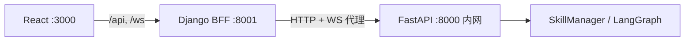

# NetOps Agent - Django + React 架构

这是 NetOps Agent 的新前端架构，使用 Django + React 替代了原先的 Streamlit 前端。

## 架构说明

- **后端（FastAPI）**：保持不变，继续处理 AI 逻辑、Agent、RAG 等
- **中间层（Django）**：新增，提供用户界面、会话管理、API 代理
- **前端（React + Ant Design）**：现代化的聊天界面，参考 Grok、GPT 等设计

## 端口分配

- Django BFF（**唯一对外 API 入口**）: `http://localhost:8001`
- React 前端: `http://localhost:3000`
- FastAPI 网关: **仅内网/本地调试**（Docker 中不映射公网端口；本地默认 `8000`）

## 安全架构

- 前端（React）只访问 Django `:8001`
- Django BFF 代理时携带 `X-Forwarded-From: django-bff` 与 `X-Internal-Request: true`
- FastAPI 在 `ENFORCE_BFF_ORIGIN=true` 或 `DEBUG=false` 时拒绝非 BFF 请求（HTTP 403 / WebSocket 4403）
- 本地直连调试 FastAPI 时可设置：`ENFORCE_BFF_ORIGIN=false`
- BFF 统一响应格式：`{ "success": true, "data": ..., "error": null }`
- JWT 鉴权：`chat`、`conversations`、`upload`、`tasks` 路由受保护；`DEBUG=True` 时默认关闭，可设 `BFF_REQUIRE_AUTH=true` 强制开启

## 快速启动

### 1. 先启动原有的 FastAPI 服务（在项目根目录）

确保 Docker 中间件已启动，然后：

```bash
# 在 netops-agent 目录
python -m src.gateway.main
```

### 2. 安装并启动 Django 后端

```bash
cd web/django_backend
pip install -r requirements.txt
python manage.py migrate
# 需使用 ASGI 服务器以支持 WebSocket 代理
daphne -b 0.0.0.0 -p 8001 django_backend.asgi:application
# 或使用 uvicorn：
# uvicorn django_backend.asgi:application --host 0.0.0.0 --port 8001 --reload
```

### 3. 安装并启动 React 前端

```bash
cd web/react_frontend
npm install
npm run dev
```

## 访问

- 前端界面: `http://localhost:3000` 或 `http://localhost:8001`
- API 健康检查: `http://localhost:8001/api/health/`
- FastAPI 文档: 仅在 `ENFORCE_BFF_ORIGIN=false` 时可通过 `http://localhost:8000/docs` 本地访问

## 开发说明

- React 组件在 `web/react_frontend/src/`
- Django BFF 视图在 `web/django_backend/bff/views/`
- WebSocket 代理在 `web/django_backend/bff/consumers.py`（路径 `/ws/v1/chat`）
- 状态管理使用 Zustand
- API 请求使用 Axios + React Query

## WebSocket 验证

```bash
# Django 与 FastAPI 启动后，测试经 BFF 的 WebSocket 代理
# new WebSocket('ws://localhost:8001/ws/v1/chat')
```

## Skills 管理界面

- 左侧导航：**Chat** / **Skills** / **Status**
- **Skills** 页：列表、搜索、新建、启用开关、View / Edit / Reload
- **Edit** 弹窗：编辑 `SKILL.md` + 上传 `scripts/` / `references/` / `assets/` 文件
- API 路径（经 Django BFF）：`/api/skills/`、`/api/skills/{name}/content/`、`/api/skills/{name}/files/`

## 架构图



## Supervisor v2 高级协同模式

FastAPI 支持通过环境变量切换 Supervisor 图实现：

| 变量 | 说明 |
|------|------|
| `USE_SUPERVISOR_V2=true` | 启用 v2：SemanticRouter 多匹配 + ExecutionPlan + Send fan-out + Map-Reduce |
| 未设置 / `false` | 使用 v1 单 Skill 决策（`graph.py`） |

v2 图结构：

```
START → pre_process → supervisor → orchestrator → skill_executor_v2 (×N) → final_aggregator → END
```

本地启用：

```bash
set USE_SUPERVISOR_V2=true
python -m src.gateway.main
```

实现文件：`src/agents/supervisor/graph_v2.py`；单元测试：`tests/agents/test_graph_v2.py`。

## 部署脚本

详见 [scripts/README.md](../scripts/README.md)。

**测试环境（本地开发）**

```powershell
.\scripts\test\install.ps1
.\scripts\test\start.ps1
.\scripts\test\e2e_supervisor_v2.ps1   # 联调
.\scripts\test\stop.ps1
```

**生产环境（全 Docker）**

```powershell
.\scripts\prod\install.ps1
.\scripts\prod\start.ps1
.\scripts\prod\stop.ps1
```
